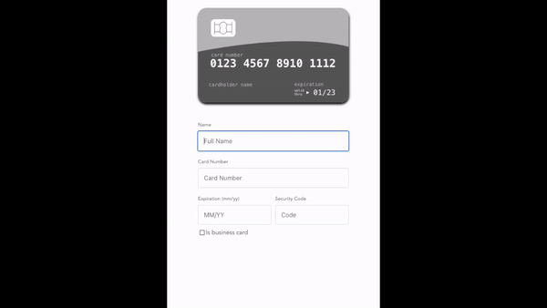
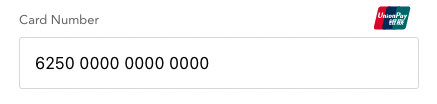
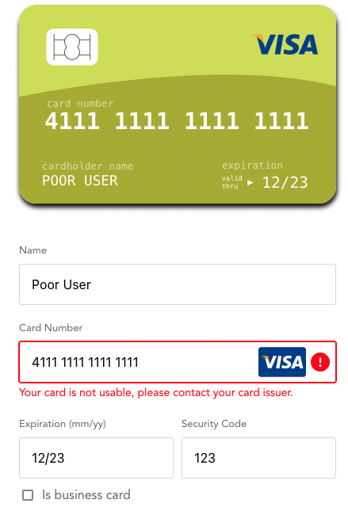
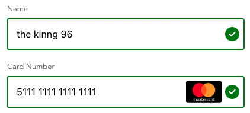

## v-credit-card

Vue friendly credit card component, forked https://github.com/AfikDeri/v-credit-card

Features:

- Business card support
- Order arrangement support
- Error handling for card
- Mini icon position configuration
- Valid mark to let user knows input is fine



#### Installation

```
npm install --save v-credit-card-component
```

#### usage

Register the component as a plugin and use it globally

```js
import Vue from 'vue';
import VCreditCard from 'v-credit-card-component';

Vue.use(VCreditCard);

// usage
<v-credit-card />;
```

#### Styles

You must import the CSS to get all the card styles

```js
import VCreditCard from 'v-credit-card-component';
import 'v-credit-card-component/dist/v-credit-card.css';
```

#### Available props

| props              | required | options                                  | default        | explanation                                                   |
| ------------------ | -------- | ---------------------------------------- | -------------- | ------------------------------------------------------------- |
| direction          | no       | column, row, column-reverse, row-reverse | column         | Card and form side-by-side or top to bottom                   |
| className          | no       | any string                               | none           | For any custom design, add your own wrapper class             |
| yearDigits         | no       | 2,4 (number)                             | 2              | construct the expiration year (YY or YYYY)                    |
| noCard             | no       | true, false                              | false          | Show only the form without the credit card image              |
| trans              | no       | ITranslation                             | default labels | Override the default labels with your own                     |
| order              | no       | Order                                    | default orders | Rearrange the input orders                                    |
| acceptBusinessCard | no       | boolean                                  | true           | Will add a toggle for business name input                     |
| cardIconConfig     | no       | ICardIconConfig                          | default config | Controlling the position of the mini card icon                |
| errorMessage       | no       | string                                   | ''             | Show the error message if process has error                   |
| showValidMark      | no       | boolean                                  | true           | Show green indicator on the input field if the input is valid |

#### Events

You can listen for the `@change` event to get an object of all the form fields with their current values

```html
<template>
  <v-credit-card @change="onInputChanged" />
</template>

<script>
  interface Data {
    name: string;
    businessName: string;
    cardNumber: string;
    expiration: string;
    security: string;
    isBusinessCard: boolean;
  }

  export default {
    // ...
    methods: {
      onInputChanged(values: Data) {
        console.log('Credit card fields', values);
      },
    },
  };
</script>
```

#### Enable and disable business credit card checkbox

This example will not hide the business card toggle.

```html
<template>
  <v-credit-card :acceptBusinessCard="false" />
</template>
```

#### Reordering input fields

This example shows how to rearrange the input fields to meet your needs.

If two input fields have the same order, the order will following as below:

businessName > name > card > security > isBusinessCardCheckbox

```html
<template>
  <v-credit-card :order="order" />
</template>

<script>
  export default {
    data() {
      return {
        // ...
        order: {
          businessName: 0, // Show on the top
          name: 1, // Show on the second
          card: 2, // Show on the third
          security: 3, // Show on the forth
          isBusinessCardCheckbox: 4, // Show on the fifth
        },
      };
    },
  };
</script>
```

#### Store the form data in your component

This example shows how to have your local data reflect the changes inside the card component.

```html
<template>
  <v-credit-card @change="onInputChanged" />
</template>

<script>
  export default {
    data() {
      return {
        name: '',
        cardNumber: '',
        expiration: '',
        security: '',
        businessName: '',
        isBusinessCard: '',
      };
    },
    methods: {
      onInputChanged(values) {
        for (const key in values) {
          this[key] = values[key];
        }
      },
    },
  };
</script>
```

If you need the card type as well (Visa, Mastercard, etc) you can listen to the `@cardChanged` event.

```html
<template>
  <v-credit-card @cardChanged="cardChanged" />
</template>

<script>
  export default {
    data() {
      return {
        // ...
        cardName: null,
      };
    },
    methods: {
      // ...
      cardChanged(cardName) {
        this.cardName = cardName;
      },
    },
  };
</script>
```

#### Mini card brand icon styling

We can configure the position of the icon as well as displaying of the icon.
PS: the icon appears after users entered a valid card number

default: `{ showIcon: true, position: 'inline' }`



```html
<template>
  <v-credit-card :cardIconConfig="cardConfig" />
</template>

<script>
  export default {
    data() {
      return {
        // ...
        cardConfig: {
          showIcon: true,
          position: 'top',
        },
      };
    },
  };
</script>
```

#### Translations

If you wish to override the default field labels, you can accomplish that by passing a custom translation object.

```html
<template>
  <v-credit-card :trans="translations" />
</template>

<script>
  const translations = {
    name: {
      label: '名前',
      placeholder: 'カードホルダー',
    },
    card: {
      label: 'クレジットカード',
      placeholder: 'クレジットカード',
    },
    expiration: {
      label: '有効期限',
    },
    businessName: {
      label: '会社名',
      placeholder: 'COREKARA INC',
    },
    security: {
      label: 'セキュリティーコード',
      placeholder: 'コード',
    },
    isBusinessCard: {
      label: 'ビジネスカードを使います',
    },
    image: {
      cardNumber: 'クレジットカード',
      cardholder: 'カードホルダー',
      expiration: '有効期限',
      valid: 'valid',
      thru: 'thru',
      security: 'セキュリティーコード',
    },
  };

  export default {
    data() {
      return {
        translations,
      };
    },
  };
</script>
```

#### Error handling when card has error

The error message will be removed if the input is dirty.



```html
<template>
  <v-credit-card :errorMessage="errorMessage" />
</template>

<script>
  export default {
    data() {
      return {
        // ...
        errorMessage: 'something wrong with the card',
      };
    },
    methods: {
      // ...
      yourApiCall() {
        fetch('api here')
          .then()
          .catch((error) => {
            this.errorMessage = error;
          });
      },
    },
  };
</script>
```

#### Valid mark

Indicator that shows if the input field has received valid value
default is `true`



```html
<template>
  <v-credit-card :showValidMark="'true'" />
</template>
```

### TYPEs

```js
// For most translation items will have a label and a placeholder
// Except: security and isBusinessCard dont have placeholders
interface ITranslationItem {
  label: string;
  placeholder?: string;
}

interface ITranslation {
  name: ITranslationItem;
  businessName: ITranslationItem;
  card: ITranslationItem;
  expiration: ITranslationItem;
  security: ITranslationItem;
  isBusinessCard: ITranslationItem;
  image: {
    cardNumber: string,
    cardholder: string,
    expiration: string,
    valid: string,
    thru: string,
    security: string,
  };
}

// Data array that will be returned on the onChange event
interface IData {
  name: string;
  businessName: string;
  cardNumber: string;
  expiration: string;
  security: string;
  isBusinessCard: boolean;
}

// Order
interface Order {
  businessName: number;
  name: number;
  card: number;
  security: number;
  isBusinessCardCheckbox: number;
}

// Configuration for the small card brand icon in the input after valid card number is typed
interface ICardIconConfig {
  showIcon?: boolean;
  position: 'inline' | 'top';
}
```

## License

MIT © 2022-present
